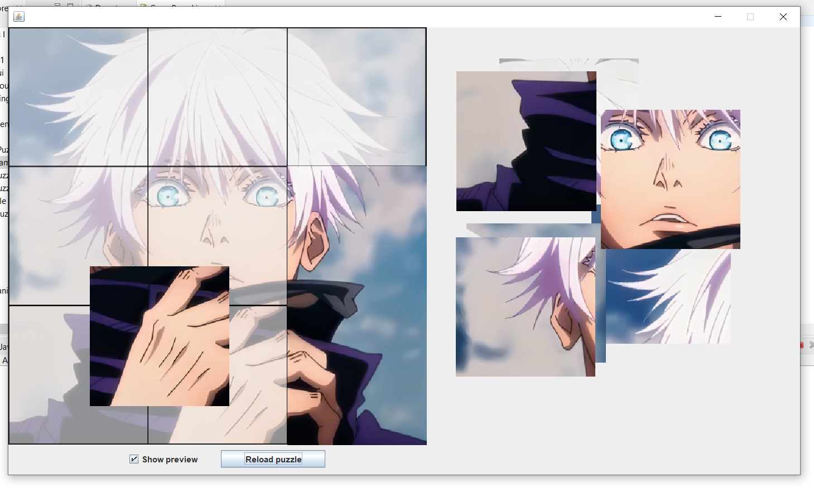

# Simple Java Puzzle

A simple puzzle made with Java and Swing. This is probably the silliest project on the list. I was a freshman with less than 8 months of programming experience, and dying to create an app with an actual UI, and the only programming language I had learned so far was Java.

This was my first time trying to create something outside of my uni curriculum, and I'll forever be proud of it.

## Project Features

- Puzzle Pieces can be dragged and dropped.
- Pieces are locked on the board once they are in the right place.
- When all pieces are in place, "Puzzle Complete" window is shown.
- Preview of final image can be shown or hidden.
- Reload Puzzle button to reset the puzzle.

</img>

