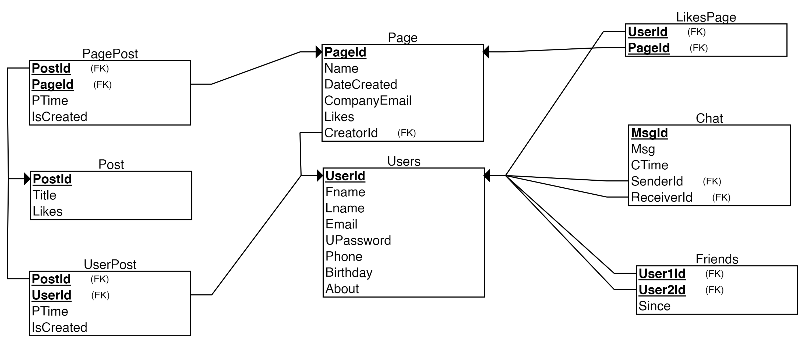

# Introduction to Databases

## Project Requirements

- Design ERD and Schema with entities (Login – User – Page – Post – Friend – [User-Post Relationship] - Chat)
- Implement database in PHPMyAdmin with MYSQL
- Create a login and signup interface and connect it with database
- Create simple page to add new post and view logged in user posts

## Our Work

### ERD:

</img>

### Relational Schema: 

</img>

### Tools

We used Flask to create the application, and Xampp to access PHPMyAdmin. 

### Application Overview

The application starts with a welcome page.

  

The user can then choose to either Sign Up or Log In.

 
  

After the user is registered, they land in this homepage, which consists of a navigation sidebar and the main feed. The main feed is where the user can see their friends posts, and share them if they would like. The user can also write their own posts.

  

The sidebar contains 5 buttons. Each button redirects to a specific page. 
The first button is My Profile. Here, the user can view their profile details and their posts, and edit their profile info. If the user clicks the Edit Profile button, a new page opens up where they can see the editable attributes of their profile and change them.

 
 

Here is the effect of updating the About attribute. 
  

The second button is the Pages button. This is where the user can create a page, manage their created pages, and like or unlike other's pages. The Create Page button at the top opens a page that prompts the user to enter the page name and the company email.
The Edit Your Page buttons allows the user to view their page's profile, where they can see the page's posts or create new ones.

 
 
 

Here is the effect of clicking the Unlike button for a liked page. 
  

The third button is the Friends button. This shows the users their friends, and allows them to add other users as friends.
  

The fourth button is Inbox. Here the user can see a list of friends they can chat with. On clicking a certain friend's name, they can access the chat with this friend, where they can see previously sent messages, and send new ones.

 
  

The fifth button is Log Out. This button simply logs the user out and redirects them to the welcome page.  

## Team Members

Verina Michel 
Marly Magdy 
Ola Mamdouh 
Maria Anwar 
Mirna Tarek 
Mariem Nasr 
