# Mobile Programming

## Project Description

Android Library Application with Firebase database  

    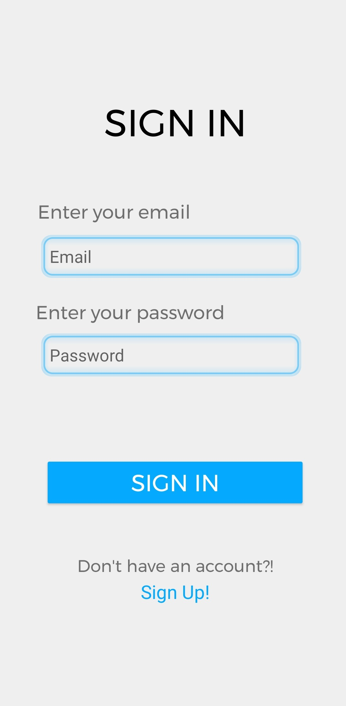
    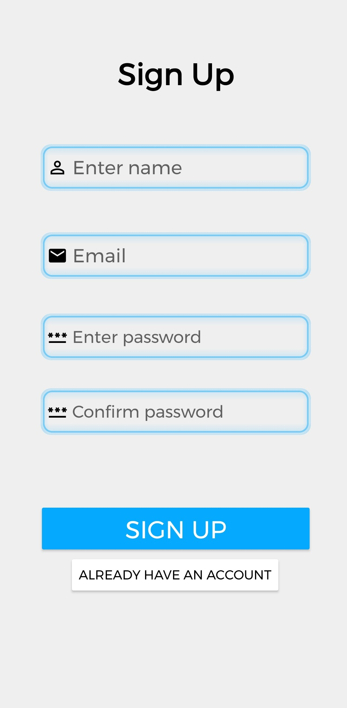
    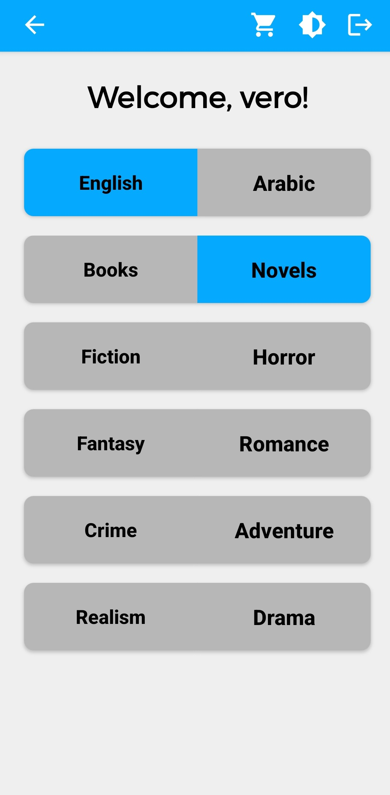
    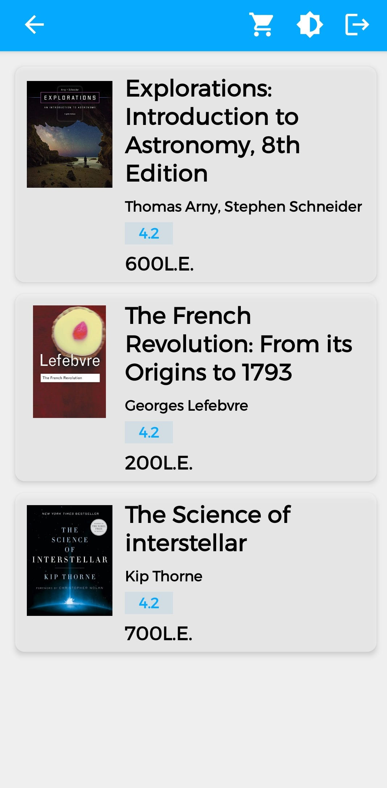
    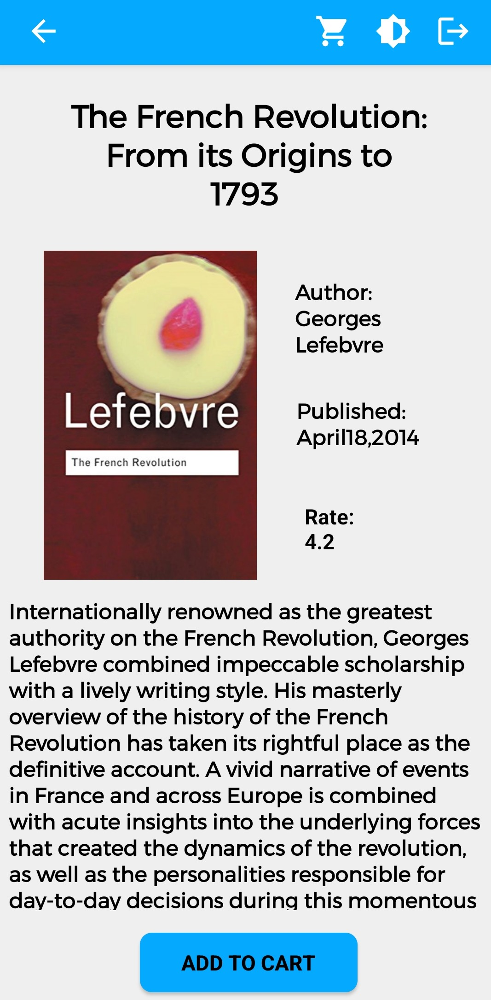
    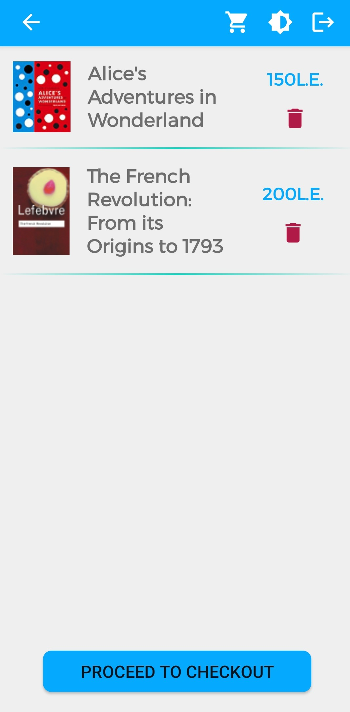
    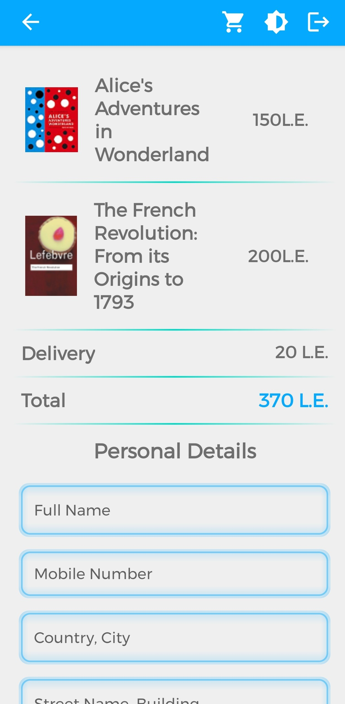
    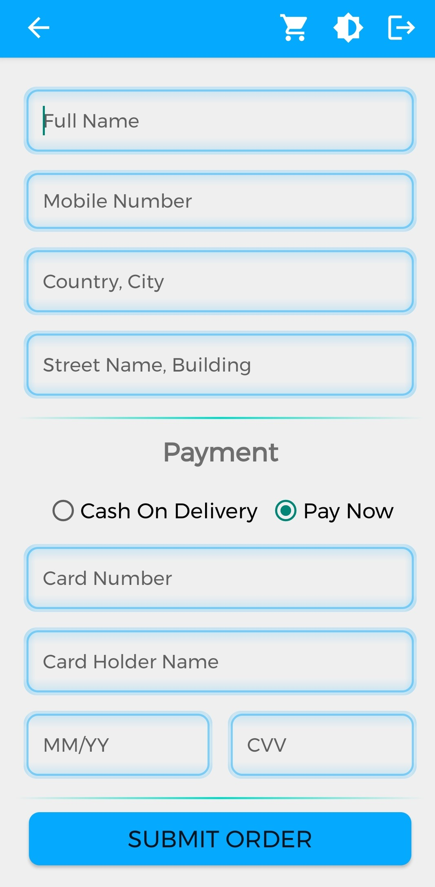
    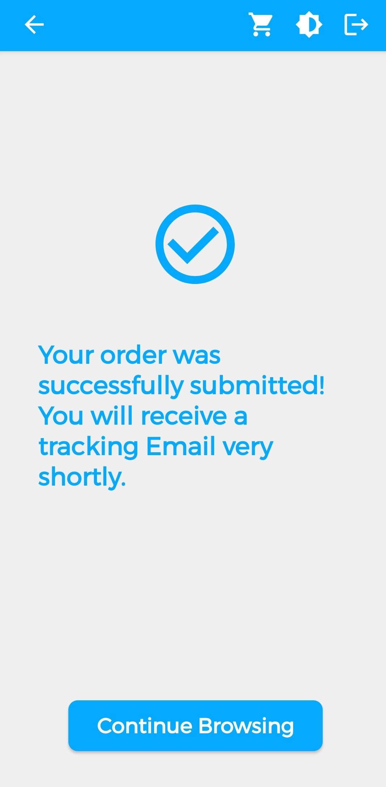

  

    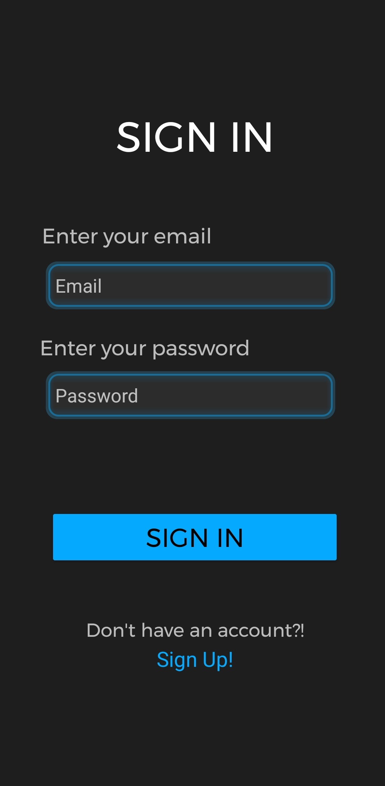
    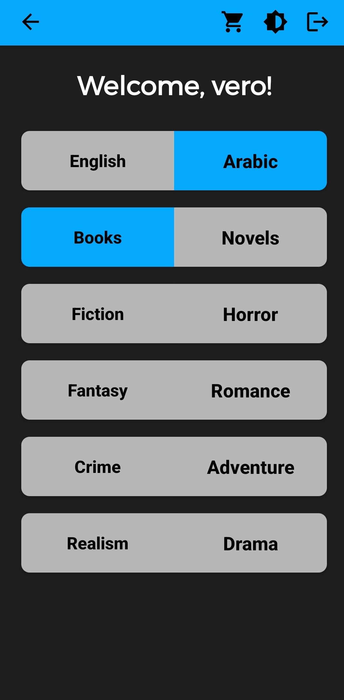
    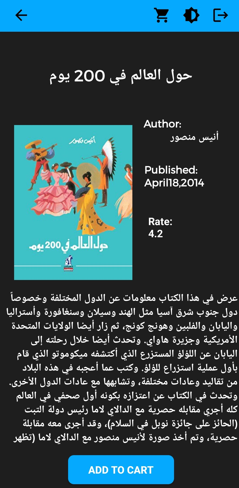
    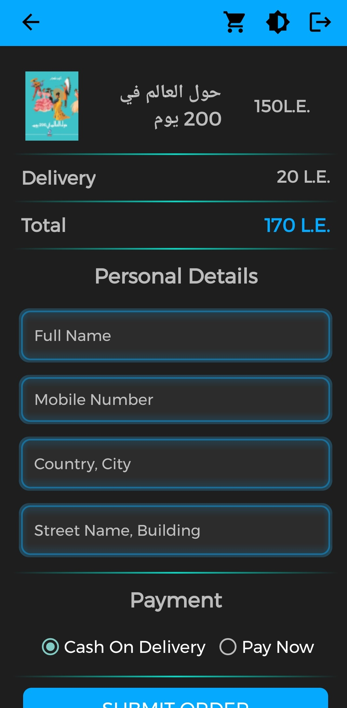

## Contributors
Govany Magdy 
Sylvia Sobhy 
Verina Michel 
Irinie Magued 
Marly Magdy 
Maria Anwar 
Mariem Nasr 

