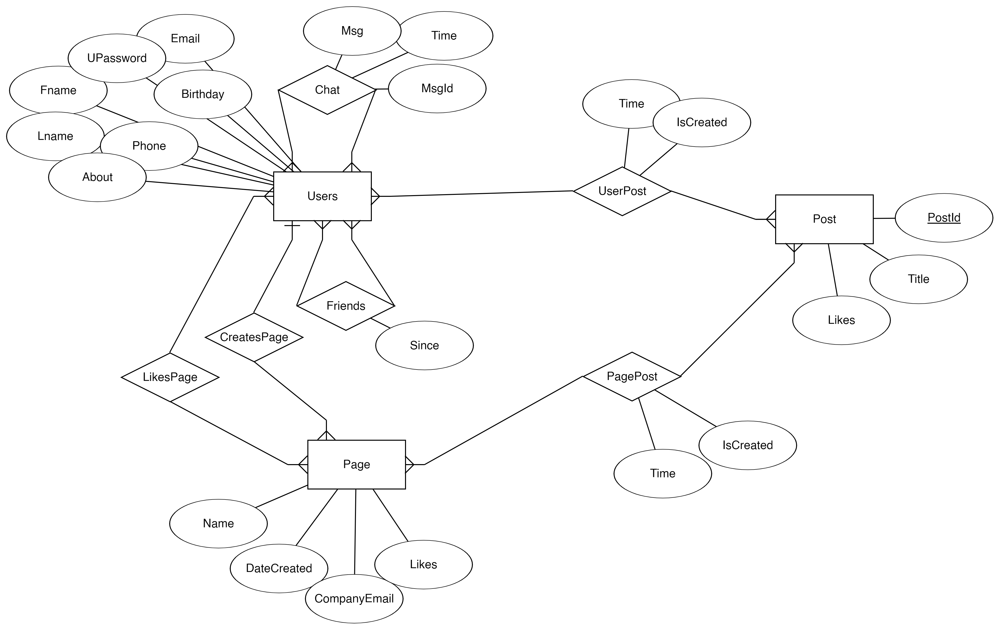
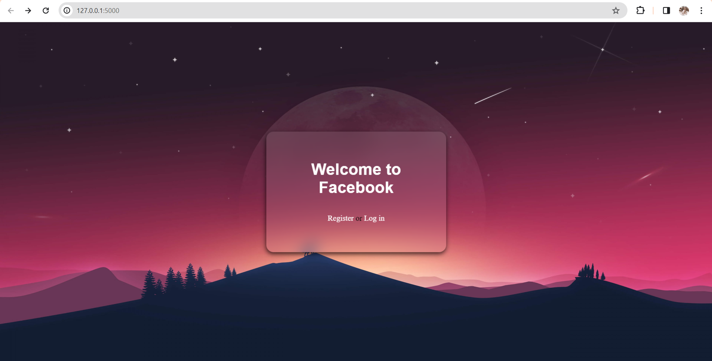
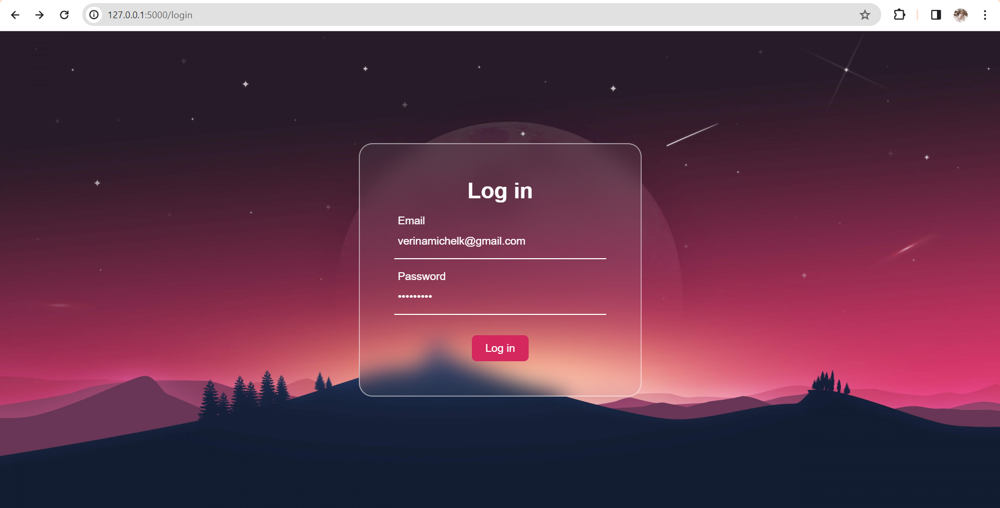
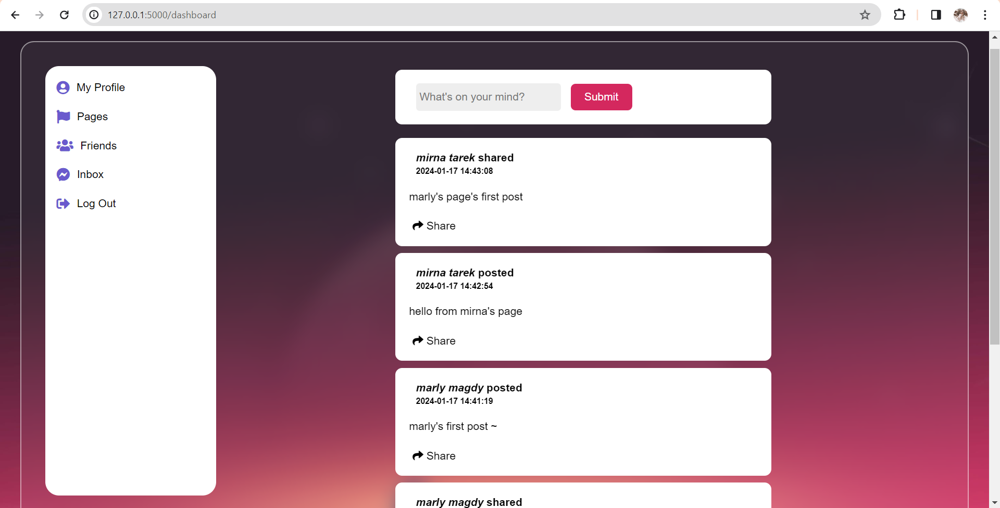
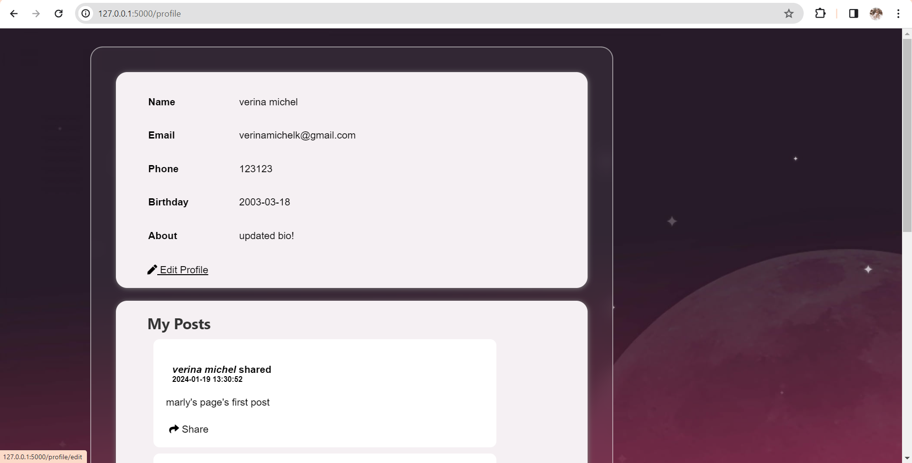
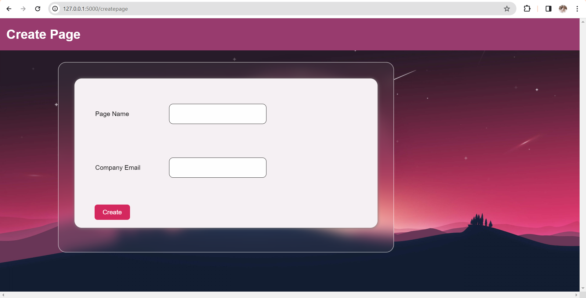
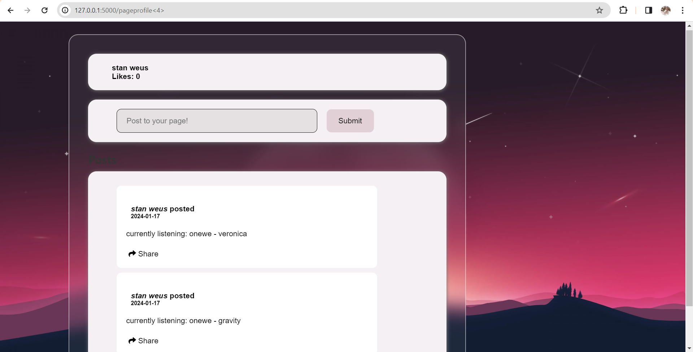

# Introduction to Databases

## Project Description

### Facebook Database with Login Page

1. Design ERD and Schema with entities (Login – User – Page – Post – Friend – [User-Post Relationship] - Chat)

    

    
Enities Description. Click to Expand. 

     

    1. User 
        A user is one of the most important entities in Facebook. Each user has the following attributes.
        - First Name — — Text
        - Last Name — — Text
        - DOB — — Date
        - Password (Hashed) — — Hash Key
        - Email — — Text
        - Phone — — Integer
        - About — — Text

    2. Page 
        A page is something that is followed by many users in Facebook. Pages are responsible for sharing posts in Facebook and they should be accessible via the profile pages and their respective timeline.
        - Name — — Text
        - Date of creation — — Timestamp
        - Created by — — Foreign Key References User
        - Company Email — — Text
        - Total Likes — — Integer

    3. Post 
        A post has the following attributes
        - Title — — Text
        - Created by — — Foreign Key References User
        - Date of creation — — Timestamp
        - Likes — — Integer

    4. Friend 
        Facebook friend is a relationship that exists between two users in Facebook. One user can have multiple such friends. The relationship has the following attributes.
        - Primary Key of 1st Person
        - Primary Key of 2nd Person
        - Time — — Timestamp

    5. User-Post Relationship 
        There are two possibilities for a post.
        - User shares a post.
        - User creates a post.
        In the first case, we fetch the ID of the post. In the latter case, we create a post and obtain its ID. This relationship has the following attributes.
        - User ID — — References User Table
        - Post ID — — References Post table.
        - Time of Sharing/Creation — — Timestamp
        - Shared/Created — — Boolean for Created
        A post can be shared by multiple users and a user can share multiple posts.

    6. Chat 
        So, how do we actually store a set of messages communicated by a set of users? For every group chat, we create a new table, which has the following attributes.
        - Message — — Text
        - User 1— — References User Table
        - User 2— — References User Table
        - Time — — Timestamp
        If a user sends a message, an insert query is sent to this table.

    

     

2. Implement database in PHPMyAdmin with MYSQL
3. Enter data for at least 3 users.
4. Creating a login and signup interface and connect it with database using php. 
    The user logs in, and if his account is registered, he will enter the database. If he is not registered, he will not enter the database.
5. Create simple page to add new post and view logged in user posts

## Our Work

### ERD:

</img>

### Relational Schema: 

</img>

### Tools

We used Flask to create the application, and Xampp to access PHPMyAdmin. 
The MySQL script used to create the database can be found [here](create.sql). 
A pdf containing the queries used in the Flask app can be found [here](queries.pdf). 

### Application Overview

The application starts with a welcome page.

  

The user can then choose to either Sign Up or Log In.

 
  

After the user is registered, they land in this homepage, which consists of a navigation sidebar and the main feed. The main feed is where the user can see their friends posts, and share them if they would like. The user can also write their own posts.

  

The sidebar contains 5 buttons. Each button redirects to a specific page. 
The first button is My Profile. Here, the user can view their profile details and their posts, and edit their profile info. If the user clicks the Edit Profile button, a new page opens up where they can see the editable attributes of their profile and change them.

 
 

Here is the effect of updating the About attribute. 
  

The second button is the Pages button. This is where the user can create a page, manage their created pages, and like or unlike other's pages. The Create Page button at the top opens a page that prompts the user to enter the page name and the company email.
The Edit Your Page buttons allows the user to view their page's profile, where they can see the page's posts or create new ones.

 
 
 

Here is the effect of clicking the Unlike button for a liked page. 
  

The third button is the Friends button. This shows the users their friends, and allows them to add other users as friends.
  

The fourth button is Inbox. Here the user can see a list of friends they can chat with. On clicking a certain friend's name, they can access the chat with this friend, where they can see previously sent messages, and send new ones.

 
  

The fifth button is Log Out. This button simply logs the user out and redirects them to the welcome page.  

## Team Members

Verina Michel 
Marly Magdy 
Ola Mamdouh 
Maria Anwar 
Mirna Tarek 
Mariem Nasr 
